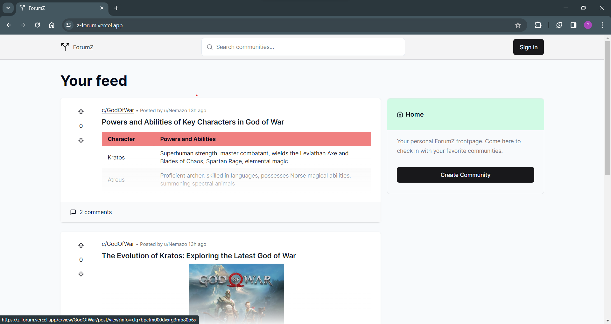

# ForumZ: Empowering Engagement, One Thread at a Time

<p align="center">
  <a href="https://z-forum.vercel.app/" target="_blank">
    
  </a>
</p>

Welcome to ForumZ! 🌟 Join the Conversation and Explore Communities.

ForumZ is a modern full-stack platform designed to foster engagement and interaction within communities. Built using Next.js App Router, TypeScript, and Tailwind, it offers a dynamic and intuitive experience for users.

🚀 **Live Site:** [Experience ForumZ Now!](https://z-forum.vercel.app/)

Built with Next.js, TypeScript, and Tailwind, ForumZ fosters engagement and interaction within communities.

## Features

- **Infinite Scrolling:** Dynamically loads posts for uninterrupted browsing.
- **Authentication:** Secure user authentication via NextAuth and Google OAuth.
- **Custom Feed:** Tailored feed for enhanced user engagement.
- **Advanced Caching:** Utilizes Upstash Redis for efficient data caching.
- **Optimistic Updates:** Smooth user experience with optimistic UI updates.
- **Modern Data Fetching:** Implements React-Query for efficient data retrieval.
- **Rich Post Editor:** Integrated @EditorJs for content creation with image uploads & link previews.
- **Full Comment Functionality:** Includes nested replies for comprehensive discussions.
- **Voting System:** Allows users to vote on posts and comments.
- **Dynamic Search Bar:** Enables active community searching.
- **User Profile Customization:** Empowers users to modify their profiles.
- **Route Protection Middleware:** Implements middleware to secure custom routes and prevent unauthorized access.
- **Route Interception for Authentication Modals:** Facilitates route interception for displaying authentication modals and managing user authentication flow.

## Tech-Stack

- **Frontend:** React with Next.js App Router, TypeScript, Tailwind CSS
- **Authentication:** Google OAuth
- **Image Upload:** Uploadthing third-party image upload server
- **Database:** Prisma ORM, MySQL
- **UI Components:** Shadcn-UI components, Lucide-React icon library
- **Rendering:** SSR + CSR rendered pages/components
- **Content Editor:** EditorJs
- **Performance Enhancement:** Lodash.Debounce for efficient queries
- **APIs:** REST APIs for custom CRUD operations

## Installation

1. **Clone the repository**

   ```bash
   git clone https://github.com/param0510/zForum.git
   ```

2. **Install dependencies**

   ```bash
   cd zForum
   npm install   # or yarn install
   ```

3. **Run the application**

   ```bash
   npm run dev   # or yarn dev
   ```

## Ready to Dive In?

ForumZ is ready for you to explore and contribute! 🚀 Whether you're here to engage with communities or contribute to this vibrant platform, we're thrilled to have you on board.

Feel free to fork this repository, raise issues, or submit pull requests. Your contributions will make ForumZ even more remarkable for everyone involved.

Let's build vibrant and engaging communities together! 🌟👩‍💻👨‍💻
